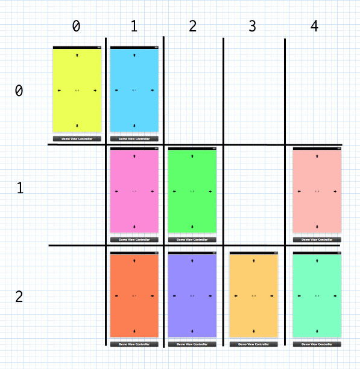

# MSMatrixController
A controller to organize you view controllers in a matrix, and navigate between them via gestures.

## How it works

Import `MSMatrixController.h` inside your prefix or application delegate. 

Organize your view controllers inside a Matrix, specifying for each of them its row and its column. Then add them inside an instance of MSMatrixController.

    - (BOOL)application:(UIApplication *)application didFinishLaunchingWithOptions:(NSDictionary *)launchOptions
    {
      UIStoryboard *currentStoryboard = [UIStoryboard storyboardWithName:@"iPhone" bundle:nil];

      UIViewController *initialViewController = self.window.rootViewController;
      MSMatrixMasterViewController *cartesianMasterViewController = [[MSMatrixMasterViewController alloc] initWithFrame:initialViewController.view.frame];

      UIViewController *position00ViewController = [currentStoryboard instantiateViewControllerWithIdentifier:@"position00"];
      position00ViewController.row = 0;
      position00ViewController.col = 0;

      UIViewController *position01ViewController = [currentStoryboard instantiateViewControllerWithIdentifier:@"position01"];
      position01ViewController.row = 0;
      position01ViewController.col = 1;
      
      UIViewController *position11ViewController = . . . . 

      NSArray *controllers = @[position00ViewController, position01ViewController, position11ViewController, position12ViewController,
    position21ViewController, position22ViewController, position23ViewController, position24ViewController, position14ViewController];
    
      [cartesianMasterViewController setControllers:controllers];

      self.window.rootViewController = cartesianMasterViewController;
      [self.window makeKeyAndVisible];
      return YES;
    }
    
    
For each controller, you can access its neighborhood:

    controller.leftViewController
    controller.rightViewController
    controller.topViewController
    controller.bottomViewController
    
The default way to navigate the matrix of controllers is with swipe gestures, but you can also move through them programmatically.

    - (void)moveLeftAnimated:(BOOL)animated;
    - (void)moveRightAnimated:(BOOL)animated;
    - (void)moveUpAnimated:(BOOL)animated;
    - (void)moveDownAnimated:(BOOL)animated;