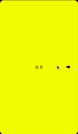
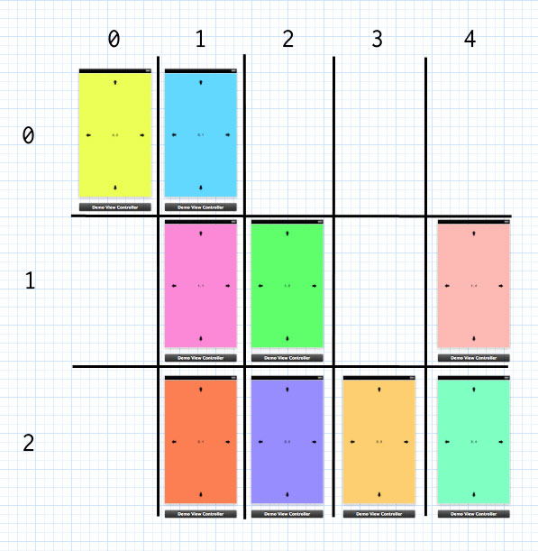

# MSMatrixController
A component to organize your view controllers in a gesture-based a 2D matrix.

## How it works

Copy the folder `MSMatrixController` inside your Xcode project.

Import `MSMatrixController.h` inside your prefix or application delegate. 

Organize your view controllers inside a Matrix, specifying for each of them its row and column. Then add them inside an instance of MSMatrixController.

    - (BOOL)application:(UIApplication *)application didFinishLaunchingWithOptions:(NSDictionary *)launchOptions
    {
      UIStoryboard *currentStoryboard = [UIStoryboard storyboardWithName:@"iPhone" bundle:nil];

      UIViewController *initialViewController = self.window.rootViewController;
      MSMatrixMasterViewController *matrixMasterViewController = [[MSMatrixMasterViewController alloc] initWithFrame:initialViewController.view.frame];

      UIViewController *position00ViewController = [currentStoryboard instantiateViewControllerWithIdentifier:@"position00"];
      position00ViewController.row = 0;
      position00ViewController.col = 0;

      UIViewController *position01ViewController = [currentStoryboard instantiateViewControllerWithIdentifier:@"position01"];
      position01ViewController.row = 0;
      position01ViewController.col = 1;
      
      UIViewController *position11ViewController = . . . . 

      NSArray *controllers = @[position00ViewController, position01ViewController, position11ViewController, position12ViewController,
    position21ViewController, position22ViewController, position23ViewController, position24ViewController, position14ViewController];
    
      [matrixMasterViewController setControllers:controllers];

      self.window.rootViewController = cartesianMasterViewController;
      [self.window makeKeyAndVisible];
      return YES;
    }

## Features  
    
For each controller, you can access its neighborhood:

    controller.leftViewController
    controller.rightViewController
    controller.topViewController
    controller.bottomViewController
    
and the matrix master controller:

    controller.matrixViewController
    
The default way to navigate the matrix of controllers is with swipe gestures, but you can move through them programmatically as well.

    - (void)moveLeftAnimated:(BOOL)animated;
    - (void)moveRightAnimated:(BOOL)animated;
    - (void)moveUpAnimated:(BOOL)animated;
    - (void)moveDownAnimated:(BOOL)animated;
    - (void)moveLeftAnimated:(BOOL)animated withCompletion:(void (^)(void))completion;
    - (void)moveRightAnimated:(BOOL)animated withCompletion:(void (^)(void))completion;
    - (void)moveUpAnimated:(BOOL)animated withCompletion:(void (^)(void))completion;
    - (void)moveDownAnimated:(BOOL)animated withCompletion:(void (^)(void))completion;
 
## Callbacks and MSMatrixControllerDelegate

At this moment, MSMatrixController does use the default UIKit callbacks when a view appears/disappears:

    - (void)viewDidAppear:(BOOL)animated;    
    - (void)viewDidDisappear:(BOOL)animated;

Also, it declares the delegate `MSMatrixControllerDelegate`:

    - (void)willMoveToViewController:(UIViewController *)viewController atPosition:(Position)position;
    - (void)didMoveToViewController:(UIViewController *)viewController atPosition:(Position)position;

## Credits

Freely inspired by [Circle](https://itunes.apple.com/gb/app/circle-whos-around-you/id488720081?mt=8) and [MBSpacialViewController](https://github.com/mobitar/MBSpacialViewController)

## Contact

Marco Sero

- http://www.marcosero.com
- http://twitter.com/marcosero 
- marco@marcosero.com

## License

MSMatrixController is available under the MIT license. See the LICENSE file for more info.

